  

    

  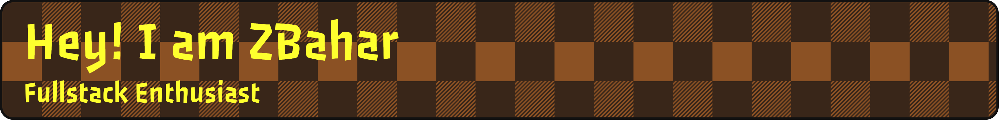

---

  

Software Developer with hands-on experience, focusing primarily on frontend development while also contributing to backend systems. Skilled in React.js, Next.js, JavaScript, TypeScript, Node.js, Express.js, Prisma, MongoDB, Prisma and modern UI frameworks such as Tailwind CSS and Material UI. Dedicated to writing clean, efficient, and maintainable code, collaborating in Agile teams, and delivering solutions that enhance performance and usability.

**Organizations**: [Medyanes 360](https://github.com/Medyanes-360) | [CodEdu](https://github.com/codEdu-Collective)

**My Portfolio**: [bahar-turksoy-portfolio.vercel.app](https://bahar-turksoy-portfolio.vercel.app/)

<table border="1" cellpadding="10" cellspacing="0" style="border-collapse: collapse; width: 100%;">
<tr>
<td>

### ⚛️ Core

</td>
<td>

### ⚙️ Backend & Database

</td>
</tr>
<tr>
<td>

### 🎨 Styling & UI

</td>
<td>

### 🧰 Tools & Workflow

</td>
</tr>
</table>

---

 

|     | Projects                                                                                                                               | Description                                                                                                                                                                                                                                                                                                                                                                                                                                                                                                                                                 |
| --- | :------------------------------------------------------------------------------------------------------------------------------------- | :---------------------------------------------------------------------------------------------------------------------------------------------------------------------------------------------------------------------------------------------------------------------------------------------------------------------------------------------------------------------------------------------------------------------------------------------------------------------------------------------------------------------------------------------------------- |
| 🧮  | **[math-scrabble](https://github.com/zbaharyilmaz/math-scrabble)**                           | Math Scrabble is an educational game designed to enhance math learning and improve calculation speed in a fun and interactive way. This first version (v1.0) focuses on core arithmetic operations — addition, subtraction, multiplication, and division — helping students practice math while enjoying strategic gameplay.  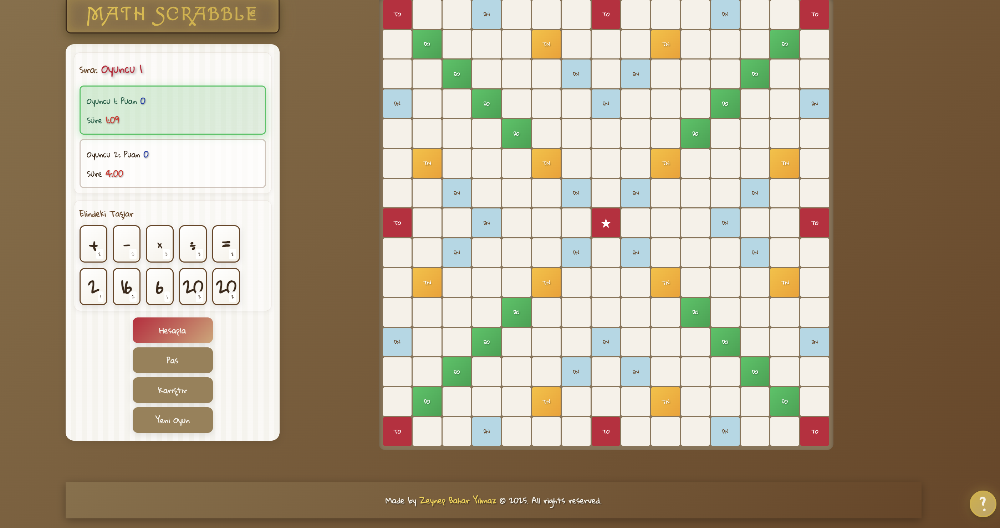                                                                                                |
| 💰  | **[split-smart](https://github.com/codEdu-Collective/split-smart)**                          | A modern group expense sharing app built with **Next.js** — track, split, and settle your expenses with friends effortlessly.                                                                                                                                                                                                                                                                                                      |
| 📈  | **[product-track-manager](https://github.com/zbaharyilmaz/product-track-manager)**           | Track Your Stock, Boost Your Growth! Product Track Manager is a modern web application for managing product data, sales, purchases, and more. Built with **React, Vite, Tailwind CSS, Redux, and Axios**, this app provides a seamless user experience for tracking and managing products efficiently.                                                                                                         |
| 🎯  | **[fullstack-todo-app](https://github.com/zbaharyilmaz/fullstack-todo-app)**                 | This project is a Fullstack Todo application built with React for the frontend and **Express (Node.js)** for the backend. It uses **SQLite and Sequelize ORM** for persistent data storage.  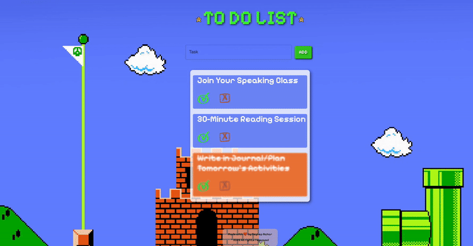                                                                                                                                                                                                                                 |
| ⚡  | **[fullstack-task-manager](https://github.com/zbaharyilmaz/fullstack-task-manager)**         | A modern and user-friendly task management application. A web-based platform with admin and user roles that provides real-time updates. Built with **React, TypeScript, Express, MongoDB**, and modern UI/UX features including gradient design and smooth animations.  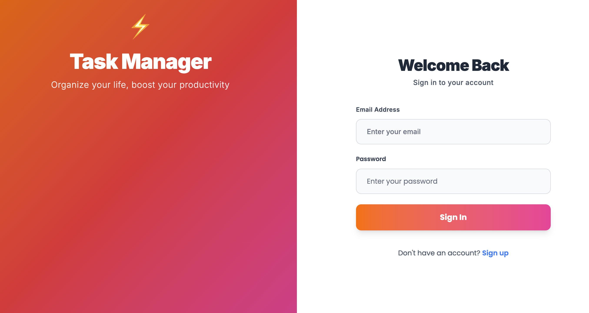                                                                                                                                                         |
| 🧠  | **[mental-health-app](https://github.com/zbaharyilmaz/mental-health-app)**                   | A web application designed to help individuals manage their mental health by providing a platform for booking appointments with psychologists. The app allows users to view a list of available psychologist, appointments, and track the status of their appointments. This application offers a user-friendly interface and features essential functionalities aimed at improving access to mental health support.   |
| 🎬  | **[ts-dune-movie-website](https://github.com/zbaharyilmaz/ts-dune-movie-website)**           | A modern, responsive website dedicated to the Dune movie franchise built with **React, TypeScript, and Sass**. Features interactive trailers, multi-page navigation, smooth animations, and a dark theme with gold accents inspired by the Dune universe.  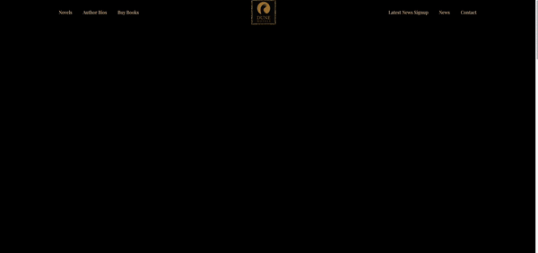                                                                                                                                                                |
| 🎬  | **[watch-hub-app](https://github.com/zbaharyilmaz/watch-hub-app)**                           | Your Ultimate Entertainment Hub! Watch Hub is a modern, full-stack entertainment discovery app built with **Next.js 15**, featuring authentication, dark mode, and a beautiful user interface. Discover movies, manage your watchlist, and enjoy a seamless viewing experience.                                                                                                                                                    |
| 💼  | **[shift-cycle-management-app](https://github.com/zbaharyilmaz/shift-cycle-management-app)** | Effortlessly manage shifts and cycles! ShiftCycle Management App is a modern frontend application designed to efficiently manage shift and cycle operations. With its user-friendly interface and robust tech stack, it enhances operational productivity with ease.  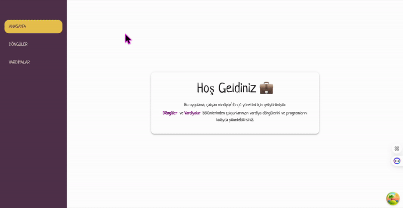                                                                                                                                          |
| 💻  | **[ts-zetech-page](https://github.com/zbaharyilmaz/ts-zetech-page)**                         | A modern corporate website for ZeTech technology education platform built with **React, TypeScript, and Bootstrap 5**. Features responsive design, orange gradient theme, parallax effects, contact form with notifications, and smooth animations for an engaging user experience.                                                                                                                                                     |
| 🎮  | **[node.js-game-store](https://github.com/zbaharyilmaz/node.js-game-store)**                 | Your Ultimate Game Store! Game Grid which is built with **Express.js, EJS, and Bootstrap** offers a smooth and responsive experience for all gamers. Browse a wide catalog of both free and paid games, separated into dedicated sections for easy discovery. Fast, clean, and full of fun — your next favorite game is just a click away.  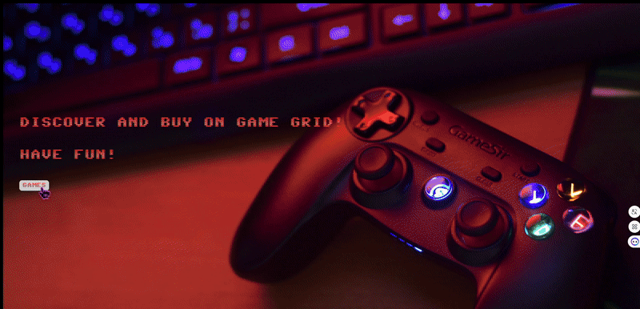                                                                          |
| ⏰  | **[next-tick-tasks](https://github.com/zbaharyilmaz/next-tick-tasks)**                       | Tick it off, keep it simple. Tick Tasks is a modern full-stack Todo app built with the latest technologies like **Next.js,MongoDB, Zustand and Prisma ORM**. Designed to help you track your daily tasks with clarity and simplicity.  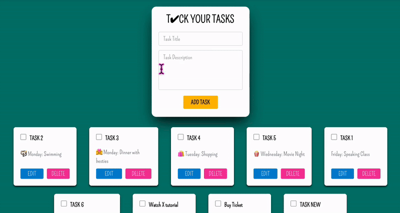                                                                                                                                                                                    |
| 🎮  | **[hypergames](https://github.com/zbaharyilmaz/hypergames)**                                 | Where Gamers Meet! HYPERGAMES is an online platform constructed with **React, Tailwind CSS and Firebase**. It allows gamers to buy video games, including both classic and new releases. The user can find the price and details of the games on this site with smooth and responsive user experience.  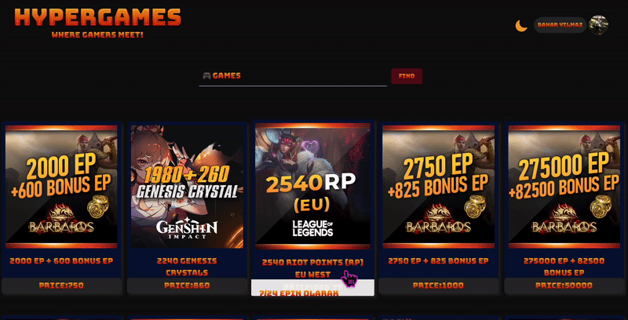                                                                                                                            |
| 🎬  | **[cineflix-app](https://github.com/zbaharyilmaz/cineflix-app)**                             | Flix Your Movie Night! Cineflix is your gateway to a vast world of movies! Search, explore, and discover movie details, ratings, and more in a sleek, user-friendly interface powered by **React, Tailwind CSS, Firebase, and Axios**. These modern technologies ensure a seamless experience, efficient data management, and fast, responsive performance.                                                                          |
| 💼  | **[portfolio-boyd-sass](https://github.com/codEdu-Collective/portfolio-boyd-sass)**          | A personal portfolio homepage showcasing the skills and projects of a Full Stack Web Developer, built using the SASS 7-1 Pattern. Includes responsive design with navigation to different sections, like About Me, My Projects, and Contact.                                                                                                                                                                              |
| 📝  | **[nextjs-todo-app](https://github.com/codEdu-Collective/nextjs-todo-app)**                  | A modern Todo app built with **Next.js 15** and **React 19**, featuring **Material-UI** components, Emotion styling, ESLint code quality, and Cypress testing. Uses MockAPI for backend data management with comprehensive testing coverage.  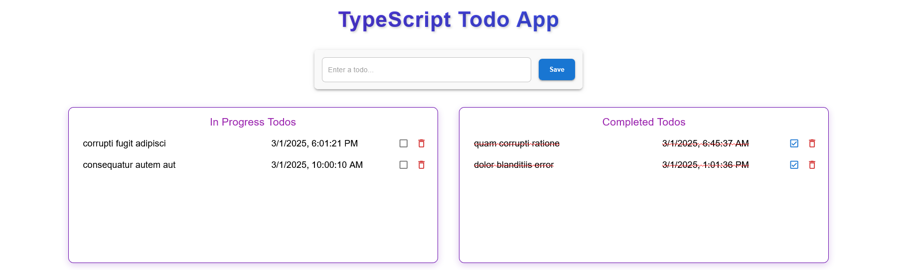                                                                                                                                                                                 |
| ☕  | **[cafebahz](https://github.com/zbaharyilmaz/cafebahz)**                                     | Modern Coffee Shop Website - Welcome to Cafebahz, a beautifully designed, responsive coffee shop website that brings the warmth and charm of a local café to the digital world!                                                                                                                                                                                                                                                          |
| 🔢  | **[guess-secret-number-game](https://github.com/zbaharyilmaz/guess-secret-number-game)**     | Guess The Secret Number Game - Project aims to create find the number game (between 0 to 100).  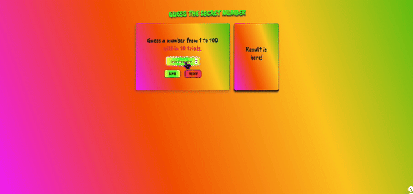                                                                                                                                                                                                                                                                                                                      |

---

  

 

  :octocat:  :octocat:  :octocat:  :octocat:  :octocat:  :octocat:  :octocat:  :octocat:  :octocat:  :octocat:  :octocat:  :octocat:  :octocat:  :octocat:  :octocat:  :octocat:  :octocat:  :octocat:  :octocat: 

