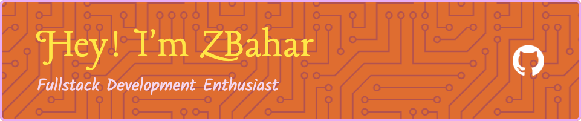

 

  

 

  

Currently, I am focusing on both frontend and backend systems, and I truly enjoy designing and developing solutions across both areas. The process of learning new languages and tackling fresh challenges every day is incredibly rewarding. My dedication to growth is matched by my commitment to delivering clean, efficient, and user-centered solutions.

 

### My Tech Stack

  
  
  
  
  
  
  
  
  
  
  
  
  
  
  
  
  
  
  
  
  
  
  
  
  
  
  
  
  
  
  

### My Stats

  

## About Me

**Passionate Problem-Solver:** Tackling complex challenges and finding innovative solutions is what drives me every day.

**Full-Stack Enthusiast:** I enjoy working across the entire development stack, whether it's designing responsive user interfaces, crafting APIs, or optimizing database performance.

**Lifelong Learner:** Staying updated with the latest technologies and trends is my way of keeping things exciting. I’m always looking to add new tools to my tech arsenal.

## My Projects

I love turning ideas into reality through code. Feel free to check out my repositories where you’ll find:

- Full-stack applications
- Interactive front-end projects
- Back-end API designs
  And much more!

## Let’s Connect!

I’m excited to collaborate with like-minded developers, contribute to meaningful projects, and grow alongside this vibrant tech community. If you're as passionate about technology as I am, let’s connect and build something amazing together!

